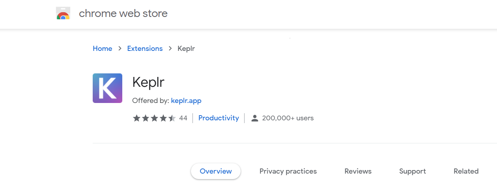

# How to Create a BitSong wallet

1. Make sure you have installed the **Keplr** browser extension. If you don't already have it, then you can download the extension and install it from [**here**](https://chrome.google.com/webstore/detail/keplr/dmkamcknogkgcdfhhbddcghachkejeap?hl=en)**.**

**2**. Once you have your Keplr extension installed, open it. In the new window that opens, select "_Create a new wallet_."

**3**. This is probably the most important step! Select the type of Mnemonic Key you want for your wallet (12 or 24 words). Then make sure you _save it and keep it safe_ since it is the only way to import or recover your wallet in case of need.&#x20;

**Remember: NO MNEMONIC PHRASE, NO MONEY**!

So name your wallet, set a password, and proceed.

**4**. You have now your brand-new Cosmos Wallet ready to use!

**5**. Now let's get your new BitSong Wallet address. Go to [https://wallet.bitsong.io/](https://wallet.bitsong.io) and among the options in the first window, select "_Keplr Browser Extension,_" per the image below.&#x20;

.png>)

**6**. Wallet.bitsong will then execute Keplr and will ask you to **add and connect the bitsong-2b** chain. You must approve both actions by signing them with Keplr.

**7**. Congratulations, you just created your new BitSong Wallet! You can see the new wallet address on the top left under the BitSong logo.

**8**. Open the Keplr extension and from the list of available chains, scroll down until you find "_**BitSong Mainnet**_" and select it.

**9**. Make sure that the BitSong wallet address shown in Keplr is the same as the one shown in wallet.bitsong.io.

Your are now all set! Your BitSong wallet is ready to interact with the BitSong Blockchain.

Governance operations must be performed within the wallet.bitsong.io interface and signed with Keplr.
